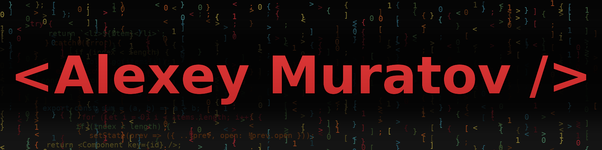

<!-- ✨ HEADER -->

  " />

  <strong>Фронтенд-разработчик · UI Enthusiast</strong>

  

---

## 🧰 Технологии и инструменты

### 💻 Frontend
          

### 🎨 Препроцессоры и шаблонизаторы
          

### ⚙️ Инструменты сборки и автоматизации
        

### 🖌 Дизайн и прототипирование
       

### 🧱 CMS и платформы
          

---

## 📊 GitHub статистика

---

## 📲 Контакты
   
